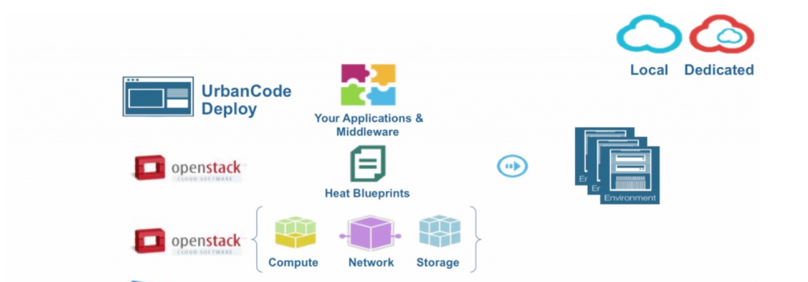
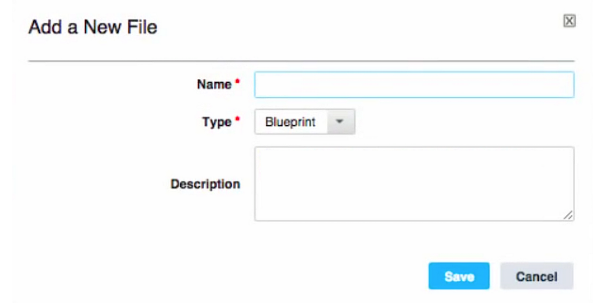
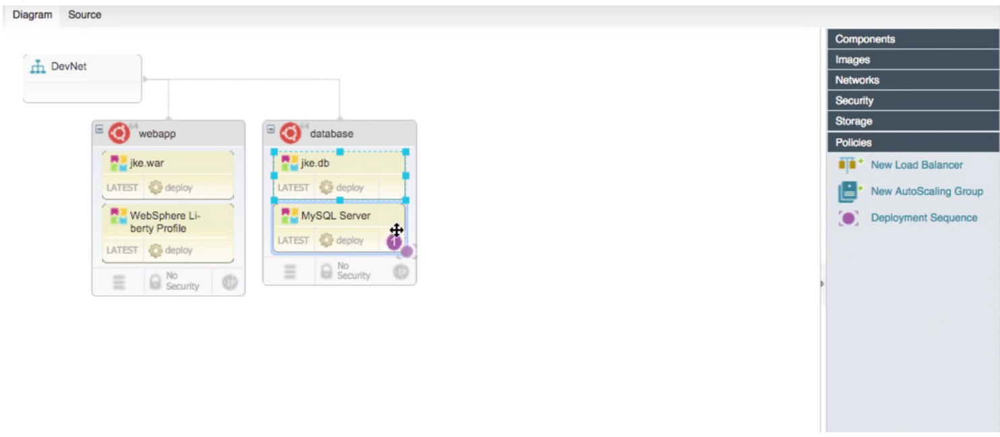
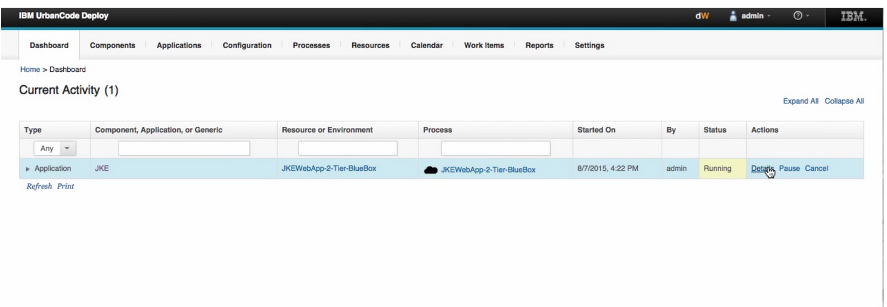
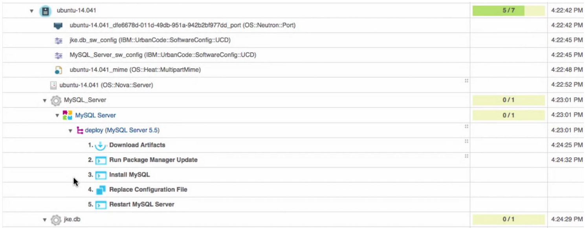
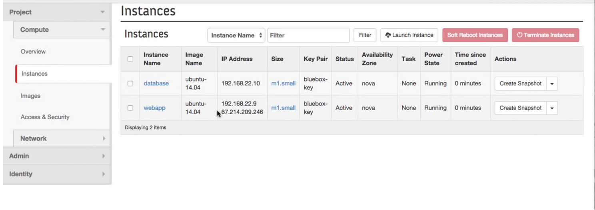

# Deploying Applications with IBM UrbanCode Deploy and IBM Bluemix Private Cloud

_This article was adapted from the following Bluemix blog post: [Get Started with IBM UrbanCode Deploy and IBM Bluemix Private Cloud](https://www.ibm.com/blogs/bluemix/2016/09/get-started-ibm-urbancode-deploy-ibm-blue-box/)_

**IBM UrbanCode Deploy** (UCD) is an application deployment automation tool that’s designed to facilitate rapid feedback and continuous delivery in agile development, while providing the audit trails, versioning, and approvals needed in production. Using UCD with **IBM Bluemix Private Cloud**, developers can accelerate their application delivery and lifecycle management across multiple cloud environments.

This Article provides a brief tutorial, covering how to:

* Provision and deploy applications using IBM UrbanCode Deploy, to an IBM Bluemix Private Cloud
* Use OpenStack Heat blueprints to set up a full-stack deployment
* Manage applications using OpenStack APIs from IBM UrbanCode Deploy

## Installing the UCD software

If you're not an existing UCD customer, you first need to download the [UCD software](https://developer.ibm.com/urbancode/products/urbancode-deploy/) and follow the installation instructions. When you install your package on VMs in a cloud environment, you’ll want to make sure these instances have public floating IPs and meet the UCD system requirements. 

** Note:** We recommend viewing the following document for full installation details, prior to getting started: [Using IBM UrbanCode Deploy with IBM Bluemix Private Cloud](http://ibm-blue-box-help.github.io/help-documentation/heat/using-ucd-ucdp/).

## Creating a blueprint in UCD

To set up a full-stack deployment, you can create a blueprint to install your applications. Your blueprint will include and display your networks, VMs, and installed software in the UCD interface, so that you can set up and deploy quickly. 

To create your blueprint, click the **New** button in the top left corner. This opens a new modal window, where you can name your blueprint, then click **Save**, as shown in the following image.

Click the plus sign (`+`) icon from the toolbar at the top of your screen to perform a search, then select the network, VMs, and applications you want to install. To set up your blueprint even faster, you can drag-and-drop the items you’d like to install, using the palette on the right of the screen. Your VMs will bind to the network automatically, and your applications will bind to your VMs automatically, once you drop them into place.

From the **Policies** tab on the right, you can use the **Deployment Sequence** icon to identify an installation order for your newly-added applications. 

You will want to make sure you’ve added your IP address to your applications. To perform this step, you can select your application, view its properties, and enter your IP address.

You’re now ready to provision your blueprint. To start provisioning, click the **Save** button at the top of your screen, then click **Provision.** This will open a modal window, which lets you define a flavor, identify an SSH key, and update your credentials before you provision.

## Connecting to OpenStack Heat

As you provision your environment, you’ll connect to an OpenStack Heat engine, which automates your VMs to enter your IBM Bluemix Private Cloud. From this single viewpoint, you can see your UCD applications and their current deployment status, as shown in the following image:

You can also click the **Details** icon from the OpenStack Heat engine, to view step-by-step progress of each installation, as shown in the following image:

Your new instances are provisioned through UCD, and the UCD agent is installed and bootstrapped for the host. Once your instances are online, your applications will install automatically.

Throughout the installation process, you can use the [OpenStack API](http://ibm-blue-box-help.github.io/help-documentation/openstack/api/openstack-api-getting-started/) client to retrieve installation logs for the server and the application. These logs can help you to identify whether there were any problems with the installation process.

## Accessing applications in OpenStack Horizon

The UCD agent deploys your full-stack in a matter of seconds. Once your applications are deployed through OpenStack Heat, you’ll have access to your instances and their applications in your IBM Bluemix Private Cloud environment. This environment is accessible through the OpenStack Horizon dashboard or through OpenStack APIs. The following image displays an example deployment, accessed through Horizon:

For more information on how to deploy applications using IBM UrbanCode Deploy and IBM Bluemix Private Cloud, you can visit the following links:

* [Demo Video: Deploy your Apps with IBM UrbanCode Deploy and IBM Bluemix Private Cloud](https://youtu.be/bQu7a3ucl8c)
* [Using IBM UrbanCode Deploy with IBM Bluemix Private Cloud](http://ibm-blue-box-help.github.io/help-documentation/heat/using-ucd-ucdp/)
* [Using UrbanCode Deploy with Vagrant](http://stackinabox.io)
