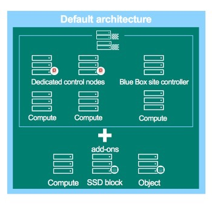

No one could underestimate the importance of computing. When computing emerged, we used electronic devices to do algebra; now, the role of computing has become increasingly vital–it’s controlling, creating, inventing, and entertaining–in every aspect of human life that we could imagine.

Because we offer computing services to our customers, it’s natural that we refuse to set a limit to our customers’ computing power–and the power that our customers, in turn, provide to their customers.

How does the IBM Bluemix Private Cloud Local team ensure the best possible customer experience?

IBM Bluemix Private Cloud, Dedicated and Local, is a solution built by cloud operators, for cloud operators, so we’re purpose-driven to optimize our deployment and expansion time for our customers. We deliver a managed, extensible private cloud as a service (PCaaS) in your own data center, thereby speeding up your application development process “behind the firewall.”

## Bring IBM Bluemix Private Cloud to your data center of choice

You may already know that IBM Bluemix Private Cloud runs in SoftLayer data centers, available worldwide, exclusively on specially selected hardware. Expansion is a highly streamlined process, because we have a full set of standardized APIs and automation tools that interact easily with the standardized hardware in IBM Cloud data centers. In other words, expansion is easy because we manage it for you, in our data centers.

In contrast, IBM Bluemix Private Cloud Local offers a turnkey, private-cloud-as-a-service (PCaaS) solution, delivered to your in-house or colocation data center. The Local cloud shares a common architecture with our Dedicated cloud solution. This common architecture lets you add compute nodes to your Local Cloud just as easily as in Dedicated Cloud, making your expansion seamless. The following diagram shows how we do it:

The IBM Bluemix Private Cloud Local architecture lets you add compute nodes easily.

IBM Bluemix Private Cloud Local is planned perfectly to accommodate your data center’s energy usage, space, heat, and wiring specifications, among other things. To start, after a site survey for the data center, we propose some hardware options that we’ve selected for maximum performance and cost efficiency. When an option of the servers and network gears is accepted, we procure the hardware and configure it with the predefined automation process, using a variety of automation tools that we’ve developed, so the hardware is tailored specifically for your environment.

During deployments, our on-site experts collaborate closely with customer data center experts to expedite the hardware racking and wiring procedures. We’re well-equipped to handle operative challenges and streamline the process.

## It’s easy to connect expansion nodes to your network

Once we’ve completed the hardware racking and wiring in our customers’ data center of choice, next we set up the servers’ initial configurations remotely using IPMI (Intelligent Platform Management Interface), including BIOS/ UEFI, RAID (Redundant Array of Independent Disks), and network adapter configuration for the newly added hardware.

The IPMI Out-Of-Band (OOB) management interface is independent from operating systems and can manage your hardware seamlessly, whether it’s powered on or off.

By using IPMI as the Out-Of-Band (OOB) management interface, we have the advantage of being independent from operating systems. We leverage this capability to manage your hardware seamlessly, whether it’s powered on or off. Besides performing basic configuration tasks, through IPMI we also can verify the server specifications and health status, and we can collect the MAC addresses for the upcoming remote installation of operating systems.

The new nodes are secured by firewalls from the beginning, and then they are added to predefined VLANs on the core networking devices that connect them to the local controller node and the central controller. These steps could vary for particular hardware and customers.

These steps get the nodes prepared for PXE. The Pre-Boot Execution Environment (PXE) allows a server to be booted from the network before it starts to run the operating system on its local hard disk drive. Then, the PXE operating system is installed so it can register the nodes with the controller node.

## Bootstrap and run OpenStack automatically: That’s it!

When we perform the bootstrapping process for IBM Bluemix Private Cloud Local, we prepare your expansion nodes with the required software and network configuration before we install OpenStack.

Our OpenStack installation is facilitated by a fully automated process developed in-house by our tooling experts. The unified code management repository keeps the package up-to-date and easily accessible.

From hardware procurement, racking, and stacking, to integration with OpenStack, we perform the deployment and expansion process seamlessly while staying in close contact with you, our customers. Once you’re up-and-running, our maintenance and 24/7 support staff are always on-call to ensure your mission-critical cloud stays running smoothly.
