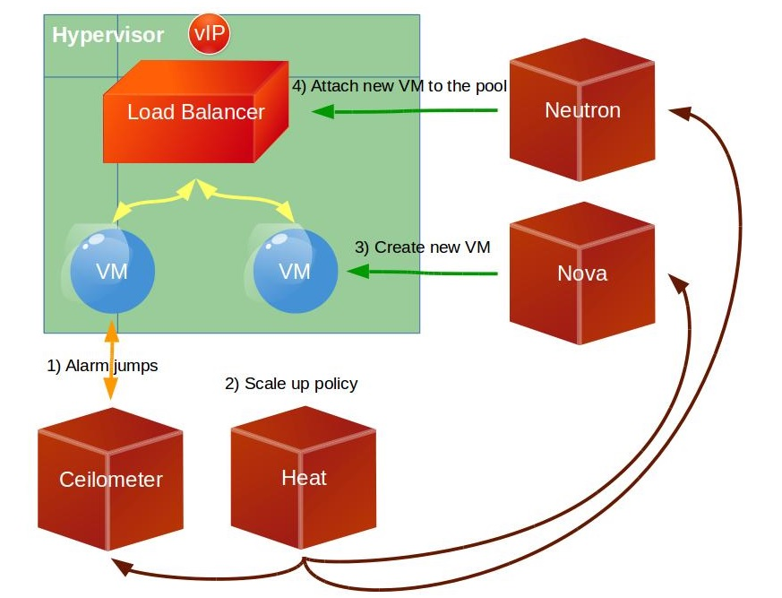

# Autoscaling with Heat
OpenStack provides autoscaling features through Heat. This feature reduces the need to manually provision instance capacities in advance. You can use Heat resources to detect when a Ceilometer alarm triggers and provision or de-provision a new VM depending on the trigger. These groups of VMs must be under a load balancer which distributes the load among the VMs on the scaling group.

Whether you are running one instance or thousands, you can use autoscaling to detect, increase, decrease, and replace instances without manual intervention.
In the following examples, the following two policies are defined:
* When the CPU utilization rate is above 50%, a new instance is created automatically until the number of instances reaches six.
* When any CPU utilization rate is below 15%, an instance is terminated until the number of instances reaches one.

## Creating stacks
1. Download the [simple scale file](../simplescale.yaml).
2. Log on to the Horizon dashboard with the heat_stack_owner role.
3. Click **Project** -> **Orchestration** -> **Stacks**.
4. Click **Launch Stack**.
5. On the Select Template page, click **Choose File** and select the simple scale file on your local machine.
6. Update the image ID, network ID, key pair name, and security group ID based on your cloud instance.
7. Click **Launch**.

## Monitoring stacks
1. Log on to the Horizon dashboard with the heat_stack_owner role.
1. Click **Project** -> **Instance** and find the instance created as part of the stack.
1. Connect to the instance with SSH connection tools such as Putty.
1. Run the top command to check CPU utilization rate. The utilization rate consumed by the dd process should be at least 99%. This triggers the CPU high utilization alarm.
1. Wait approximately ten minutes and verify that a new instance is created as part of the stack.
1. Log in to both instances, find the dd process, and terminate it. This triggers the CPU low utilization alarm.
1. Wait approximately ten minutes and verify that one of the instance is terminated and only one remains.

## Removing stacks
1. Log on to the Horizon dashboard with the heat_stack_owner role.
1. Click **Project** -> **Orchestration** -> **Stacks**.
1. Select the stack that you want to remove and click **Delete**.

## Example of deploying a WordPress stack

You can find an auto-scaling example template for Heat on the official [OpenStack Github repository](https://github.com/openstack/heat-templates/tree/master/hot). This example uses a [similar template](https://gist.github.com/chechuironman/c99c2d303712ea10e27d) based on the official one, which uses a snapshot of a VM with WordPress already installed and configured over an Ubuntu operating system as a base image.

You need the following parameters:


	parameters:
	image:
	type: string
	description: Image used for servers
	default: "your wordpress image ID"
	key:
	type: string
	description: SSH key to connect to the servers
	default: "your SSH key ID"
	flavor:
	type: string
	description: flavor used by the web servers
	default: Standard_1_2
	network:
	type: string
	description: Network used by the server
	default: "your private network ID"
	subnet_id:
	type: string
	description: subnet on which the load balancer will be located
	default: "your subnet on the private network ID"
	external_network_id:
	type: string
	description: UUID of a Neutron external network
	default: "your public network ID"


The first resource you will provision is the health monitor configuration that will check the VMs under the load balancer. If the VM is down, the load balancer will not send traffic to it. Create the pool using the health monitor and specifying the protocol, the network and subnet, the algorithm to use for distributing the traffic, and the port that will receive the traffic on the virtual IP. Finally, create the load balancer using this pool.


    Create the health monitor, pool, and load balancer:
	monitor:
	type: OS::Neutron::HealthMonitor
	properties:
	type: TCP
	delay: 5
	max_retries: 5
	timeout: 5
	pool:
	type: OS::Neutron::Pool
	properties:
	protocol: HTTP
	monitors: [{get_resource: monitor}]
	subnet_id: {get_param: subnet_id}
	lb_method: ROUND_ROBIN
	vip:
	protocol_port: 80
	lb:
	type: OS::Neutron::LoadBalancer
	properties:
	protocol_port: 80
	pool_id: {get_resource: pool}


Associate a public IP for the load balancer so that it can be accessed from the Internet. Use the following syntax to create a floating IP for the load balancer:


    lb_floating:
    type: OS::Neutron::FloatingIP
    properties:
    floating_network_id: {get_param: external_network_id}
    port_id: {get_attr: [pool, vip, port_id]}


Use a Heat specific resource to define the scaling group: size and image that will be used to scale (lb_server.yaml). You must make some changes on the database as every time the saved image is initialized, the public IP must be updated on the database. Use the user data to do this.

* Use the following syntax to create the auto-scaling group (VMs):


    asg:
    type: OS::Heat::AutoScalingGroup
    properties:
    min_size: 1
    max_size: 3
    resource:
    type: lb_server.yaml
    properties:
    flavor: {get_param: flavor}
    image: {get_param: image}
    key_name: {get_param: key}
    network: {get_param: network}
    pool_id: {get_resource: pool}
    metadata: {"metering.stack": {get_param: "OS::stack_id"}}
    user_data:
    str_replace:
    template: |
    #!/bin/bash -v
    sudo mysql -uroot -p"password" <<EOF
    use wordpress;
    update wp_options set option_value='http://$ip/wordpress' where option_id = 2;
    update wp_options set option_value='http://$ip/wordpress' where option_id = 1;
    EOF
    params:
    $ip: { get_attr: [lb_floating, floating_ip_address] }


* Using specific Heat resources, define both up and down scaling policies. Use the following syntax to create scaling policies:


	web_server_scaleup_policy:
	type: OS::Heat::ScalingPolicy
	properties:
	adjustment_type: change_in_capacity
	auto_scaling_group_id: {get_resource: asg}
	cooldown: 60
	scaling_adjustment: 1
	web_server_scaledown_policy:
	type: OS::Heat::ScalingPolicy
	properties:
	adjustment_type: change_in_capacity
	auto_scaling_group_id: {get_resource: asg}
	cooldown: 60
	scaling_adjustment: -1


* Use Ceilometer to establish the alarms (both high and low) for the auto-scaling group for a specific metric. Use the following syntax to create Ceilometer alarms:
    

	cpu_alarm_high:
	type: OS::Ceilometer::Alarm
	properties:
	description: Scale-up if the average CPU > 50% for 1 minute
	meter_name: cpu_util
	statistic: avg
	period: 60
	evaluation_periods: 1
	threshold: 50
	alarm_actions:
	- {get_attr: [web_server_scaleup_policy, alarm_url]}
	matching_metadata: {'metadata.user_metadata.stack': {get_param: "OS::stack_id"}}
	comparison_operator: gt
	cpu_alarm_low:
	type: OS::Ceilometer::Alarm
	properties:
	description: Scale-down if the average CPU < 15% for 10 minutes
	meter_name: cpu_util
	statistic: avg
	period: 600
	evaluation_periods: 1
	threshold: 15
	alarm_actions:
	- {get_attr: [web_server_scaledown_policy, alarm_url]}
	matching_metadata: {'metadata.user_metadata.stack': {get_param: "OS::stack_id"}}
	comparison_operator: lt


* On another file called lb_server.yaml, define the image to initialize each time that the alarm triggers. These are the parameters that will be filled from the original template (the official one):

 
  parameters:
    image:
    type: string
    description: Image used for servers
    key_name:
    type: string
    description: SSH key to connect to the servers
    flavor:
    type: string
    description: flavor used by the servers
    pool_id:
    type: string
    description: Pool to contact
    metadata:
    type: json
    user_data:
    type: string
    description: Server user_data
    network:
    type: string
    description: Network used by the server


* The first resource is the Nova server that you will initialize from a specific image. In our example, this is Ubuntu 14.04 with WordPress already installed and configured:


    resources:
    server:
    type: OS::Nova::Server
    properties:
    name: "base Server"
    flavor: {get_param: flavor}
    image: {get_param: image}
    key_name: {get_param: key_name}
    metadata: {get_param: metadata}
    user_data: {get_param: user_data}
    user_data_format: RAW
    networks: [{network: {get_param: network} }]
    The last resource for this template is a pool member in Neutron that will add the IP of the new server that was initialized to the pool on the load balancer:
    member:
    type: OS::Neutron::PoolMember
    properties:
    pool_id: {get_param: pool_id}
    address: {get_attr: [server, first_address]}
    protocol_port: 80

	
## Process diagrams
The following diagram shows the process when you launch the Heat stack:

When the VM reaches the high CPU load limit that you set, the alarm in Ceilometer triggers and a new VM is initialized. This diagram shows the process:

The same process occurs when a VM reaches the low CPU load limit as shown in this diagram:

